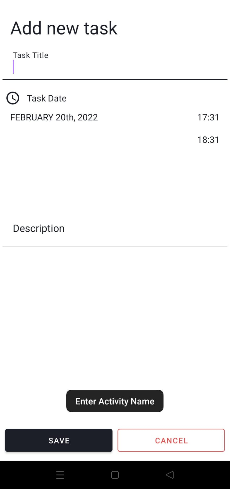
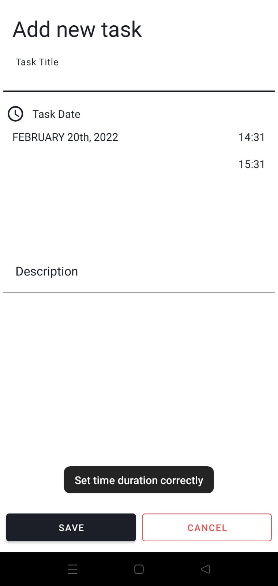

# ToDoApp !

This is a simple ToDo application built from the ACM android dev task.
Firebase support will be added within a few days; other than that, it checks all the requirements stated.

# Screenshots:
 

